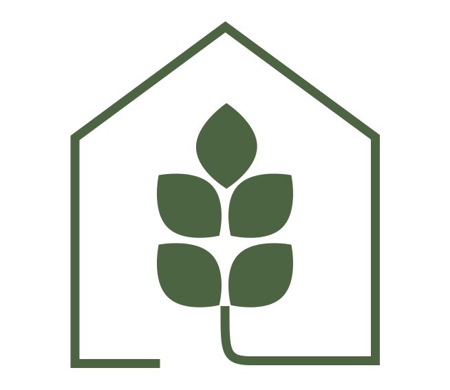

<p align="center">
  <a>
    
  </a>
</p>

<h1 align="center">
  Greenhouse
</h1>

Mobile application aimed at accelerating digitalization within mushroom factories. Greenhouse facilitates communication and monitoring between technical supervisors and company administrators by allowing remote access to real-time data regarding various stages of mushroom cultivation.

## Technologies used

- [Flutter](https://flutter.dev/): Open source framework for building multi-platform applications.

## Getting started

1. Open the command prompt and clone the repository:

```
git clone https://github.com/greenhouse-mobile/greenhouse_flutter.git
```

2. Navigate to the project directory.

3. Run the following command to install the necessary dependencies:

```
flutter pub get
```

4. Run the project with:

```
flutter run
```

## Project structure

```
.
└── lib
    ├── database
    |
    ├── models
    |
    ├── repositories
    |
    ├── screens
    |
    ├── services
    |
    ├── utils
    |
    └── widgets
```
